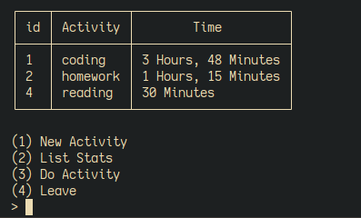

# Time Tracker 

A CLI application that tracks
how much time you spent doing anything

## Inspiration

I was browsing through my steam
video game library and felt a little 
sad once I seen how much time 
I had spent on video games.

Then I thought what if I could see 
how much time I spent doing literally 
anything else?

## Dependencies 

Require 

* sqlite3

* [cli-table](https://rubygems.org/gems/cli-table)

## Goals

Planning on fleshing everything out 
here, once I consider it complete will
make it into a GUI app with [Tauri](https://tauri.app/)
